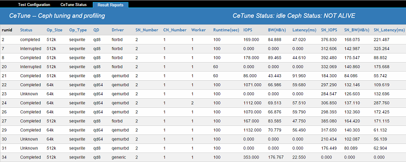

#### Functionality Description
- CeTune is a toolkit/framework to deploy, benchmark, profile and tune *Ceph cluster performance. 
- Aim to speed up the procedure of benchmarking *Ceph performance, and provide clear data charts of system metrics, latency breakdown data for users to analyze *Ceph performance.
- CeTune provides test performance through three interfaces: block, file system and object to evaluate *Ceph.

* * *
#### Maintainance
- CeTune is an opensource project, under LGPL V2.1, Drived by INTEL BDT CSE team.
- Maillist: https://github.com/01org/CeTune
- Subscribe maillist: https://lists.01.org/mailman/listinfo/cephperformance

* * *
#### Prepare
- one node as CeTune controller(AKA head), Other nodes as CeTune worker(AKA worker).
- Head is able to autossh to all workers include himself, head has a 'hosts' file contains all workers info.
- All nodes are able to connect to yum/apt-get repository and also being able to wget/curl from ceph.com.

* * *
#### Installation
- Install to head and workers:

```
head and workers need deploy apt-get,wget,pip proxy.
apt-get install -y python
```

- Install to head:

```
git clone https://github.com/01org/CeTune.git

cd /CeTune/deploy/
python controller_dependencies_install.py

# make sure head is able to autossh all worker nodes and 127.0.0.1
cd ${CeTune_PATH}/deploy/prepare-scripts; ./configure_autossh.sh ${host} ${ssh_password}
```

- Install to workers:

```
cd /CeTune/deploy/
python worker_dependencies_install.py
```

* * *
#### Start CeTune with WebUI

```
# install webpy python module
cd ${CeTune_PATH}/webui/ 
git clone https://github.com/webpy/webpy.git

cd webpy
python setup.py install

# run CeTune webui
cd ${CeTune_PATH}/webui/
Python webui.py

# you will see below output
root@client01:/CeTune/webui# python webui.py
http://0.0.0.0:8080/
```

#### Add user for CeTune

```
cd /CeTune/visualizer/
# show help
python user_Management.py --help

# add a user
cd /CeTune/visualizer/
python user_Management.py -o add --user_name {set username} --passwd {set passwd} --role {set user role[admin|readonly]}

# delete a user
python user_Management.py -o del --user_name {username}

# list all user
python user_Management.py -o list

# update a user role
python user_Management.py -o up --user_name {username} --role {set user role[admin|readonly]}
```

- CeTune WebUI


* * *
#### Configure
- Use WebUI 'Test Configuration' Page, you can specify all the deploy and benchmark required configuration.
- Also users are also able to directly modify conf/all.conf, conf/tuner.yaml, conf/cases.conf to do configuration.
- Configuration helper is both under 'helper' tag, right after 'User Guide' and shows on the configuration page.
- Below is a brief intro of all configuration files' objective:
    - conf/all.conf
        - This is a configuration file to describe cluster, benchmark.
    - conf/tuner.yaml
        - This is a configuration file to tune ceph cluster, including pool configuration, ceph.conf, disk tuning, etc.
    - conf/cases.conf
        - This is a configuration file to decide which test case to run.

* * *
#### Deploy Ceph
Assume ceph is installed on all nodes, this part is demonstrate the workflow of using CeTune to deploy osd and mon to bring up a healthy ceph cluster.
- Configure nodes info under 'Cluster Configuration'

| KEY | VALUE | DESCRIPTION |
| --- | ----- | ----------- |
| clean build | true / false | Set true, clean current deployed ceph and redeploy a new cluster; Set false, try obtain current cluster layout, and add new osd to the existing cluster |
| head | ${hostname} | Cetune controller node hostname |
| user | root | Only support root currently |
| enable_rgw | true / false | Set true, cetune will also deploy radosgw; Set false, only deploy osd and rbd nodes |
| list_server | ${hostname1},${hostname2},... | List osd nodes here, split by ',' |
| list_client | ${hostname1},${hostname2},... | List client(rbd/cosbench worker) nodes here, split by ',' |
| list_mon | ${hostname1},${hostname2},... | List mon nodes here, split by ',' |
| ${server_name} | ${osd_device1}:${journal_device1},${osd_device2}:${journal_device2},... | After adding nodes at 'list_server', cetune will add new lines whose key is the server's name;Add osd:journal pair to corresponding node, split by ',' |

- Uncheck 'Benchmark' and only check 'Deploy', then click 'Execute'


- WebUI will jump to 'CeTune Status' and you will about to see below console logs


* * *
#### Benchmark Ceph
- Users are able to configure disk_read_ahead, scheduler, etc at 'system' settings.
- Ceph.conf Tuning can be added to 'Ceph Tuning', so CeTune will runtime apply to ceph cluster.
- 'Benchmark Configuration' is how we control the benchmark process, will give a detail explaination below.
    - There are two parts under 'Benchmark Configuration'.
    - the first table is to control some basic settings like where to store result data, what data will be collected, etc.
    - The second table is to control what testcase will be run, users can add multi testcase, so all the testcases will be run one by one.


* * *
#### Check Benchmark Results




* * *
#### User Guidance PDF
[CeTune Documents Download Url](https://github.com/01org/CeTune/blob/master/CeTune%20Document.pdf)

